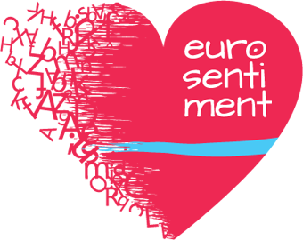

[Eurosentiment Generator](http://demos.gsi.dit.upm.es/eurosentiment/generator) 
==================================

Introduction
---------------------
This tool will take several input formats and translates them to semantic formats. It focuses on translating corpora to the NIF+[Marl](http://gsi.dit.upm.es/ontologies/marl) format, usin json-ld.

Eurosentiment Generator is under heavy development. As of this writing, it supports:

* Creating and administrating translation templates (admin level)
* Editing templates to convert traditional formats (csv, tsv, xls, xml) formats to NIF+Marl+Onyx.
* Using the available templates to translate known formats through this portal or via POST requests
* Saving or outputting the result
* HTTP API
* Logging translation requests

In the future, we might include the following features:
* Conversion of semantic formats
* Automatic translation between semantic formats (e.g. [RDF](http://www.w3.org/RDF/) to [JSON-LD](http://json-ld.org/))
* Auto selection of the best template based on the input format

Translating a document
----------------------
Documents can be translated via the Web Interface or using the REST interface.
Actually, the form in the Web is simply a convenient way of accessing the REST interface which shows all the available templates and a field to upload the desired file.

The Generator endpoint takes the following parameters:

 * input (i): The original file to be translated
 * informat (f): The format of the original file
 * intype (t) [Optional]:
    * direct (default)
    * url
    * file
 * outformat (o):
    * json-ld
    * rdfxml
    * turtle (default, to comply with NIF)
    * ntriples
    * trix
 * base URI (u) [Optional]: base URI to use for the corpus
 * prefix (p) [Optional]: prefix to replace the base URI
 * template (t) [Optional]: ID of the template to use. If it is omitted, a template to convert from informat to outformat will be used, or a template from informat to another format (e.g. json-ld), with automatic conversion.
 * toFile [Optional]: Whether the result should be sent in the response (default) or written to a file. For convenience, this value defaults to False when using the Web Form.

Using the command line tool *curl*, a request can be made like this:

    curl -F"template=Example_to_Marl" -F"input=@input-file.csv" -F"intype=FILE"
        http://demos.gsi.dit.upm.es/eurosentiment/marlgenerator/process
        > result.jsonld

Installation instructions
------------------------------
This repository contains all the code necessary to run an eurosentiment-generator. To install it, follow the following steps:

* Copy the eurosentiment/settings-private.py.template to eurosentiment/settings-private.py
* Add your database information to settings.py
* Create a virtualenv (preferably, in the project root)
* Install the required packages:

    pip install -r requirements.txt

* Test the environment with:

    python manage.py runserver localhost:<PORT>


If the standalone server works, you can try serving the portal via apache/nginx and WSGI. It has been tested with apache2 and uwsgi. In that case you will also need to serve the static files from your web server. An example configuration for Apache2 would be:

```
<VirtualHost *:80>

    [ ... ]

    WSGIScriptAlias /eurosentiment /path_to_eurosentiment/eurosentiment/wsgi.py
    WSGIDaemonProcess eurosentiment user=www-data group=www-data processes=nprocesses threads=nthreads python-path=/path_to_eurosentiment:/path_to_eurosentiment/venv/lib/python2.7/site-packages
    WSGIProcessGroup eurosentiment
    <Directory /path_to_eurosentiment>
    Order allow,deny
    Allow from all
    </Directory>

    Alias /eurosentiment/robots.txt /path_to_eurosentiment/static/robots.txt
    Alias /eurosentiment/favicon.ico /path_to_eurosentiment/static/favicon.ico

    AliasMatch ^eurosentiment/([^/]*\.css) /path_to_eurosentiment/static/styles/$1

    Alias /eurosentiment/media/ /path_to_eurosentiment/media/
    Alias /eurosentiment/static/ /path_to_eurosentiment/static/

    <Directory /path_to_eurosentiment/static>
    Order deny,allow
    Allow from all
    Options -Indexes
    </Directory>

    <Directory /path_to_eurosentiment/media>
    Order deny,allow
    Allow from all
    Options -Indexes
    </Directory>

</VirtualHost>
```

Acknowledgement
---------------
EUROSENTIMENT PROJECT
Grant Agreement no: 296277
Starting date: 01/09/2012
Project duration: 24 months



